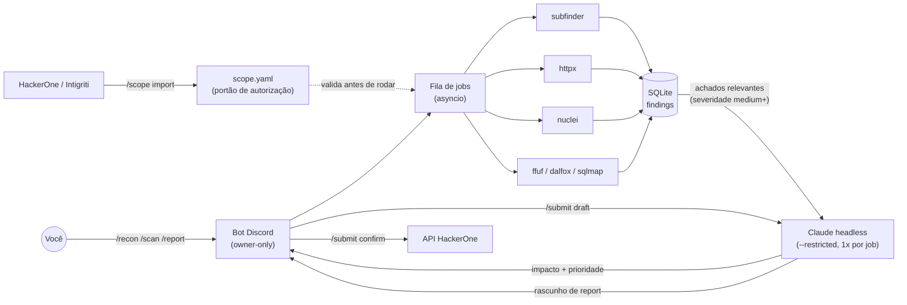

# 🤖 megatron

**Framework autônomo de bug bounty, controlado 100% via Discord.** As
ferramentas escaneiam; o Claude analisa com foco em impacto real; você
aperta o botão final. Nada sai pra um programa sem sua confirmação manual.


---

## Índice

- [O que é isso](#o-que-é-isso)
- [Como funciona](#como-funciona)
- [Por que "econômico"](#por-que-econômico)
- [Instalação](#instalação)
- [Criando o bot no Discord](#criando-o-bot-no-discord)
- [Configurando o escopo](#configurando-o-escopo-obrigatório)
- [Comandos](#comandos)
- [Integração com plataformas](#integração-com-plataformas-hackerone--intigriti)
- [Segurança e uso responsável](#segurança-e-uso-responsável)
- [Estrutura do projeto](#estrutura-do-projeto)
- [Roadmap](#roadmap)

## O que é isso

`megatron` é um analista de bug bounty que nunca dorme: um bot de Discord
privado que você comanda com slash commands, orquestrando recon passivo
(subfinder → httpx → nuclei) e scan ativo leve (ffuf, dalfox, sqlmap) contra
alvos que **você explicitamente autorizou** em `scope.yaml`.

A diferença pro "mais um script de recon": o Claude Code entra como cérebro
analítico — não pra rodar comandos, mas pra **triar achados com foco em
impacto real** (o que um atacante consegue de fato fazer, não só a label de
severidade de uma ferramenta), escrever reports, e até rascunhar submissões
pro HackerOne. Tudo isso gastando o mínimo de invocações possível, porque
ninguém quer estourar o plano Pro rodando recon 24/7.

## Como funciona



Cada peça tem um único trabalho (veja [Estrutura do projeto](#estrutura-do-projeto)):
ferramentas fazem I/O de rede, o Claude só recebe JSON já filtrado/deduplicado
e devolve JSON estruturado (schema forçado via `--json-schema`), o Discord é
só a interface.

## Por que "econômico"

O Claude **nunca vê uma linha crua de ferramenta**. O pipeline em Python
filtra e deduplica tudo antes; Claude é chamado no máximo:

- **1x por job** de recon/scan (triagem) — e só se houver achado relevante.
- **1x por `/report`** — sob demanda.
- **1x por `/submit draft`** — sob demanda.

Uma quota diária configurável (`MEGATRON_CLAUDE_DAILY_BUDGET`) trava novas
chamadas quando estourada — os achados brutos continuam disponíveis via
`/findings`, só sem a análise. O bot te avisa no Discord quando o uso cruzar
80% da quota, pra você nunca ser pego de surpresa.

As chamadas rodam via `claude -p --restricted --setting-sources ""` — sem
acesso a tools, arquivos ou ao `CLAUDE.md` do projeto. É um analista de
texto puro, não um agente com as mãos livres.

## Instalação

### Com Docker (recomendado)

```bash
git clone https://github.com/gshell0st/megatron.git
cd megatron
make          # cria .env/scope.yaml a partir dos .example, builda e sobe
make logs     # acompanhar
```

O container reusa a sessão do Claude Code já autenticada no seu host
(monta `~/.claude` e `~/.claude.json` read-only) — não precisa `claude
login` nem `ANTHROPIC_API_KEY` dentro do container.

### Manual

```bash
git clone https://github.com/gshell0st/megatron.git
cd megatron
python3 -m venv .venv
.venv/bin/pip install -r requirements.txt
cp .env.example .env
cp scope.yaml.example scope.yaml

.venv/bin/python megatron initdb
.venv/bin/python megatron run
```

Requer também: `subfinder`, `httpx`, `nuclei`, `katana`, `gau`, `ffuf`,
`sqlmap`, `dalfox`, `nmap` no PATH (ou configurados via `TOOL_PATH_*` no
`.env`) e o [Claude Code CLI](https://github.com/anthropics/claude-code)
autenticado.

Pra rodar 24/7 sem Docker, veja `scripts/run_dev.sh` (tmux) ou
`scripts/megatron.service` (systemd --user, restart automático).

## Criando o bot no Discord

1. [Discord Developer Portal](https://discord.com/developers/applications) → **New Application**.
2. Aba **Bot** → **Reset Token** → cole em `DISCORD_BOT_TOKEN` no `.env`.
   (Não confundir com o *Application ID*/*Public Key* da aba "General
   Information" — são coisas diferentes.)
3. Desative "Public Bot" (só você deve poder convidar).
4. **OAuth2 → URL Generator** → scopes `bot` + `applications.commands`,
   permissões: `View Channels`, `Send Messages`, `Embed Links`, `Read
   Message History`. Abra a URL gerada e convide o bot pro **seu servidor
   privado** (só você + o bot).
5. Ative o **Modo Desenvolvedor** (Config do Discord → Avançado). Com ele
   ativo, botão direito em qualquer coisa dá a opção "Copiar ID":
   - Seu usuário → `OWNER_DISCORD_ID`
   - O servidor → `GUILD_ID`
   - Um canal de texto (crie um `#megatron-status`) → `STATUS_CHANNEL_ID`

## Configurando o escopo (obrigatório)

`scope.yaml` (gitignored, nunca commitado) é o **único** lugar que decide o
que o bot pode tocar. Qualquer alvo fora dele é recusado, sem exceção —
mesmo que alguém peça por outro canal.

```yaml
targets:
  - domain: seu-alvo-autorizado.com
    mode: passive          # passive = só recon | active = libera /scan
    rate_limit_rps: 5
    excluded_paths: []
    notes: "Programa X no HackerOne"
```

## Comandos

| Comando | O que faz |
|---|---|
| `/scope list\|add\|remove\|reload` | Gerencia `scope.yaml` |
| `/scope import platform:hackerone\|intigriti handle:<programa>` | Importa escopo via API oficial do pesquisador (sempre como `mode=passive`) |
| `/recon target` | Pipeline subfinder → httpx → nuclei |
| `/scan target type:ffuf\|xss\|sqli [url]` | Scan ativo leve (exige `mode=active`; xss/sqli exigem `url` com parâmetro) |
| `/jobs status [job_id]\|cancel job_id` | Acompanha/cancela jobs |
| `/findings target [severity] [status]` | Lista achados |
| `/report target` | Resumo escrito (1 chamada Claude) dos achados pendentes |
| `/submit draft target` | Rascunho de report HackerOne a partir de achados priorizados |
| `/submit confirm draft_id` | Envia de fato — **nunca automático**, só nesse comando |
| `/submit list\|discard` | Gerencia rascunhos pendentes |
| `/quota` | Uso diário de invocações do Claude |
| `/system pause\|resume` | Kill switch global |

O heartbeat horário no canal de status mostra uptime, fila e uso de quota;
o mesmo canal recebe um aviso quando a quota cruza 80%.

## Integração com plataformas (HackerOne / Intigriti)

Confirmado por pesquisa direta nas APIs, não assumido: HackerOne tem
endpoint real de submissão de report por pesquisador; Intigriti só tem API
de leitura (programas/escopo); Bugcrowd não expõe API pública pra nenhum
dos dois lados de pesquisador — por isso fica de fora.

- `/scope import` importa domínios sempre como `mode=passive` — ligar scan
  ativo é decisão manual sua, sempre.
- `/submit draft` gera e guarda um rascunho; a chamada real à API do
  HackerOne só acontece em `/submit confirm`, depois de você revisar o
  texto gerado.
- HackerOne exige Signal ≥ 1.0 na conta pra aceitar submissões via API
  (regra deles).

## Segurança e uso responsável

Esta ferramenta automatiza testes de segurança e deve ser usada **apenas**
contra alvos para os quais você tem autorização explícita (programa de bug
bounty, VDP, contrato de pentest, ou seu próprio sistema). `scope.yaml` é a
barreira técnica; a responsabilidade legal é sua. Os autores não se
responsabilizam por uso indevido.

Defaults conservadores por design: `nuclei` exclui tags `dos`/`fuzz`/
`intrusive`/`default-login`; `sqlmap` roda em `--risk=1 --level=1`, sem
técnicas destrutivas (stacked queries excluídas); `ffuf`/`dalfox` usam
wordlists curtas e rate limit configurável por alvo.

## Estrutura do projeto

```
bot/                 discord.py — comandos, formatação, client
core/config.py       env vars, resolução de paths de tools
core/scope/          scope.yaml loader + validador (o portão de segurança)
core/db/             schema SQLite + wrapper async
core/tools/          um wrapper por ferramenta (build_command + parse_output)
core/pipelines/      orquestra os wrappers em sequência (recon.py, active_scan.py)
core/jobs/           fila asyncio + runner de subprocess
core/claude_bridge/  invocação headless do Claude (quota, prompts, invoke)
core/platforms/      clientes HackerOne (leitura+submit) e Intigriti (leitura)
core/findings/       dedup por hash + filtro de severidade
```

Convenções de código e invariantes de segurança: [`CLAUDE.md`](CLAUDE.md).

## Roadmap

- [ ] `katana`/`gau` no pipeline de recon (descoberta de endpoints)
- [ ] Descoberta automática de URLs parametrizadas pra `/scan type:xss|sqli`
- [ ] Deploy em instância cloud (hoje: WSL/local + Docker)

---

Feito com [Claude Code](https://claude.com/claude-code) como cérebro
analítico. Licença [MIT](LICENSE).
