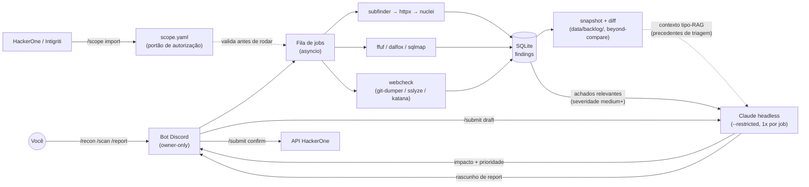

# 🤖 megatron

**Framework autônomo de bug bounty, controlado 100% via Discord.** As
ferramentas escaneiam; o Claude analisa com foco em impacto real; você
aperta o botão final. Nada sai pra um programa sem sua confirmação manual.


---

## Índice

- [O que é isso](#o-que-é-isso)
- [Como funciona](#como-funciona)
- [Por que "econômico"](#por-que-econômico)
- [Instalação](#instalação)
- [Criando o bot no Discord](#criando-o-bot-no-discord)
- [Configurando o escopo](#configurando-o-escopo-obrigatório)
- [Comandos](#comandos)
- [Histórico de testes e retest (`/backlog`)](#histórico-de-testes-e-retest-backlog)
- [Checks de higiene web (`/scan type:webcheck`)](#checks-de-higiene-web-scan-typewebcheck)
- [Integração com plataformas](#integração-com-plataformas-hackerone--intigriti)
- [Segurança e uso responsável](#segurança-e-uso-responsável)
- [Estrutura do projeto](#estrutura-do-projeto)
- [Roadmap](#roadmap)

## O que é isso

`megatron` é um analista de bug bounty que nunca dorme: um bot de Discord
privado que você comanda com slash commands, orquestrando três camadas de
teste contra alvos que **você explicitamente autorizou** em `scope.yaml`:

1. **Recon passivo** — `subfinder → httpx → nuclei`.
2. **Scan ativo leve** — `ffuf` (arquivos expostos), `dalfox` (XSS), `sqlmap`
   (SQLi), e `webcheck` — 11 categorias de higiene web num único job
   (git/.env/backups expostos, Swagger/GraphQL, actuator/debug, headers,
   cookies, TLS, endpoints interessantes).
3. **Memória entre testes** — todo job grava um snapshot em
   `data/backlog/<alvo>/`; no próximo teste do mesmo alvo, um diff
   determinístico mostra exatamente o que mudou desde a última vez, e esse
   histórico vira contexto pra próxima triagem do Claude.

A diferença pro "mais um script de recon": o Claude Code entra como cérebro
analítico — não pra rodar comandos, mas pra **triar achados com foco em
impacto real** (o que um atacante consegue de fato fazer, não só a label de
severidade de uma ferramenta), escrever reports, e até rascunhar submissões
pro HackerOne. Tudo isso gastando o mínimo de invocações possível, porque
ninguém quer estourar o plano Pro rodando recon 24/7.

## Como funciona



Cada peça tem um único trabalho (veja [Estrutura do projeto](#estrutura-do-projeto)):
ferramentas fazem I/O de rede, o Claude só recebe JSON já filtrado/deduplicado
e devolve JSON estruturado (schema forçado via `--json-schema`), o Discord é
só a interface.

## Por que "econômico"

O Claude **nunca vê uma linha crua de ferramenta**. O pipeline em Python
filtra, deduplica e pontua tudo antes; Claude é chamado no máximo:

- **1x por job** de recon/scan (triagem) — e só se houver achado relevante.
- **1x por `/report`** — sob demanda.
- **1x por `/submit draft`** — sob demanda.

Uma quota diária configurável (`MEGATRON_CLAUDE_DAILY_BUDGET`) trava novas
chamadas quando estourada — os achados brutos continuam disponíveis via
`/findings`, só sem a análise. O bot te avisa no Discord quando o uso cruzar
80% da quota, pra você nunca ser pego de surpresa.

As chamadas rodam via `claude -p --restricted --setting-sources ""` — sem
acesso a tools, arquivos ou ao `CLAUDE.md` do projeto. É um analista de
texto puro, não um agente com as mãos livres.

## Instalação

### Com Docker (recomendado)

**Não instale nenhuma ferramenta separadamente.** A imagem já vem com
`subfinder`, `httpx`, `nuclei`, `katana`, `gau`, `dalfox` (compilados),
`ffuf`/`sqlmap`/`nmap` (apt), `git-dumper`/`sslyze` (via `requirements.txt`,
mesmo passo que já instala as libs Python) e o próprio Claude Code CLI (npm)
— tudo dentro do container. O único pré-requisito no host é o Docker
instalado.

```bash
git clone https://github.com/gshell0st/megatron.git
cd megatron
make          # cria .env/scope.yaml a partir dos .example, builda e sobe
make logs     # acompanhar
```

O container reusa a sessão do Claude Code já autenticada no seu host
(monta `~/.claude` e `~/.claude.json` read-only) — não precisa `claude
login` nem `ANTHROPIC_API_KEY` dentro do container.

Pra rodar numa máquina nova (VPS, outra box): instale só o Docker lá, copie
o repositório (ou `git clone`) + seu `.env`/`scope.yaml` já preenchidos, e
rode `make`. Nada de `apt install subfinder` nem `go install` na máquina
de destino — se você está instalando uma tool manualmente, algo saiu do
fluxo pretendido.

### Manual

```bash
git clone https://github.com/gshell0st/megatron.git
cd megatron
python3 -m venv .venv
.venv/bin/pip install -r requirements.txt
cp .env.example .env
cp scope.yaml.example scope.yaml

.venv/bin/python megatron initdb
.venv/bin/python megatron run
```

Requer também: `subfinder`, `httpx`, `nuclei`, `katana`, `gau`, `ffuf`,
`sqlmap`, `dalfox`, `nmap` no PATH (ou configurados via `TOOL_PATH_*` no
`.env`) e o [Claude Code CLI](https://github.com/anthropics/claude-code)
autenticado. `git-dumper`/`sslyze` já vêm com `pip install -r
requirements.txt` acima — se a venv não estiver ativada, `core/config.py`
acha os binários em `.venv/bin/` automaticamente. **Esse é o único caminho
de instalação que exige instalar as ferramentas você mesmo** — se não tem
um motivo específico pra rodar fora de container, use o caminho Docker
acima.

Pra rodar 24/7 sem Docker, veja `scripts/run_dev.sh` (tmux) ou
`scripts/megatron.service` (systemd --user, restart automático).

## Criando o bot no Discord

1. [Discord Developer Portal](https://discord.com/developers/applications) → **New Application**.
2. Aba **Bot** → **Reset Token** → cole em `DISCORD_BOT_TOKEN` no `.env`.
   (Não confundir com o *Application ID*/*Public Key* da aba "General
   Information" — são coisas diferentes.)
3. Desative "Public Bot" (só você deve poder convidar).
4. **OAuth2 → URL Generator** → scopes `bot` + `applications.commands`,
   permissões: `View Channels`, `Send Messages`, `Embed Links`, `Read
   Message History`. Abra a URL gerada e convide o bot pro **seu servidor
   privado** (só você + o bot).
5. Ative o **Modo Desenvolvedor** (Config do Discord → Avançado). Com ele
   ativo, botão direito em qualquer coisa dá a opção "Copiar ID":
   - Seu usuário → `OWNER_DISCORD_ID`
   - O servidor → `GUILD_ID`
   - Um canal de texto (crie um `#megatron-status`) → `STATUS_CHANNEL_ID`

## Configurando o escopo (obrigatório)

`scope.yaml` (gitignored, nunca commitado) é o **único** lugar que decide o
que o bot pode tocar. Qualquer alvo fora dele é recusado, sem exceção —
mesmo que alguém peça por outro canal.

Editar esse arquivo à mão é opcional, não obrigatório: no dia a dia, o
alvo entra pelo próprio Discord, sem precisar mexer em nada no servidor —
```
/scope add domain:novo-alvo.com mode:passive rate_limit_rps:5 excluded_paths:/admin,/billing
```
já cria (ou atualiza) a entrada, incluindo os paths que `ffuf`/`dalfox`/
`sqlmap`/`webcheck` nunca devem tocar. `/scope import` faz o mesmo em lote a
partir de um programa HackerOne/Intigriti. Editar `scope.yaml` direto
continua possível pra revisar tudo de uma vez, mas nada aqui exige isso.

```yaml
targets:
  - domain: seu-alvo-autorizado.com
    mode: passive          # passive = só recon | active = libera /scan
    rate_limit_rps: 5
    excluded_paths: []
    notes: "Programa X no HackerOne"
```

## Comandos

| Comando | O que faz |
|---|---|
| `/scope list\|add\|remove\|reload` | Gerencia `scope.yaml` |
| `/scope import platform:hackerone\|intigriti handle:<programa>` | Importa escopo via API oficial do pesquisador (sempre como `mode=passive`) |
| `/recon target` | Pipeline subfinder → httpx → nuclei |
| `/scan target type:ffuf\|xss\|sqli\|webcheck [url]` | Scan ativo leve (exige `mode=active`; xss/sqli exigem `url` com parâmetro; `webcheck` roda as [11 categorias de higiene web](#checks-de-higiene-web-scan-typewebcheck)) |
| `/jobs status [job_id]\|cancel job_id` | Acompanha/cancela jobs |
| `/findings target [severity] [status]` | Lista achados |
| `/backlog show target` | Último diff ("beyond compare") desde o teste anterior — veja [Histórico de testes e retest](#histórico-de-testes-e-retest-backlog) |
| `/backlog history target` | Lista todos os snapshots (testes) registrados pro alvo |
| `/report target` | Resumo escrito (1 chamada Claude) dos achados pendentes |
| `/submit draft target` | Rascunho de report HackerOne a partir de achados priorizados |
| `/submit confirm draft_id` | Envia de fato — **nunca automático**, só nesse comando |
| `/submit list\|discard` | Gerencia rascunhos pendentes |
| `/quota` | Uso diário de invocações do Claude |
| `/system pause\|resume` | Kill switch global |

O heartbeat horário no canal de status mostra uptime, fila e uso de quota;
o mesmo canal recebe um aviso quando a quota cruza 80%.

## Histórico de testes e retest (`/backlog`)

Todo job de recon/scan termina gravando um snapshot completo dos achados do
alvo em `data/backlog/<alvo>/<timestamp>__job<id>.json` — um histórico
legível em disco, não só linhas numa tabela. No próximo teste do mesmo
alvo, `core/backlog/diff.py` compara o snapshot novo com o anterior e monta
um "beyond compare" determinístico:

- **Achados novos** desde o último teste.
- **Achados não redetectados** — existiam antes e não apareceram de novo
  (pode ter sido corrigido, ou o host caiu; vale confirmar antes de
  descartar).
- **Hosts novos** e uma contagem do que ficou **inalterado**.

Isso já aparece como mensagem de progresso no Discord logo após o job. Mas
o uso mais importante é interno: esse diff alimenta a *mesma* chamada de
triagem do Claude — **sem gastar invocação extra** — com um contexto no
estilo RAG (`core/backlog/context.py`) montado a partir do histórico real
do próprio alvo, não de um vetor DB genérico:

- Os achados novos deste teste são cruzados com veredictos que o Claude já
  deu **para esse mesmo alvo** em testes anteriores (mesma ferramenta +
  mesmo tipo de achado) — se um `.env` exposto já foi julgado alto impacto
  antes, essa precedência entra como contexto pra próxima decisão.
- A lista de "não redetectado" entra também, pra Claude decidir se algo
  disso merece uma ação de acompanhamento.

Nada disso adiciona uma chamada de Claude nova: o histórico só torna a
*mesma* chamada de triagem mais informada. Use `/backlog show target` pra
ver o último diff sem gastar quota nenhuma, ou `/backlog history target`
pra ver todos os testes já registrados.

## Checks de higiene web (`/scan type:webcheck`)

Onze categorias, uma execução, um job — pra Claude nunca precisar vasculhar
achado por achado. `core/checks/webcheck.py` faz as checagens em processo
(sem subprocess) via `aiohttp`, e `core/pipelines/webcheck.py` orquestra as
três ferramentas externas dedicadas (`git-dumper`, `sslyze`, `katana`) por
cima. Cada categoria é pontuada com foco em **impacto real**, não em "path
respondeu 200" — todo hit é primeiro validado contra uma baseline de
soft-404 do próprio host (comparando o *conteúdo* da resposta, não só
tamanho/status) antes de virar achado, e as categorias de conteúdo
inspecionado (`.env`, backups, git, actuator) só sobem pra triagem do
Claude quando o corpo da resposta bate com algo genuinamente sensível.

| Categoria | O que verifica | Ferramenta |
|---|---|---|
| Exposed `.env` / secrets | Busca `.env*` e varre o conteúdo com regex de secrets (AWS key, chave privada, token Slack/GitHub, connection string com credencial) | `core/checks/webcheck.py` + `core/checks/secrets.py` |
| Git exposto (`/.git/`) | Confirma `.git/HEAD`/`.git/config` reais (não só 200) e, se confirmado, **reconstrói o repositório** — evidência concreta, não só "path existe" | `core/checks/webcheck.py` → `git-dumper` |
| Backup/config expostos | `backup.zip/.sql/.tar.gz`, `dump.sql`, `wp-config.php.bak`, `web.config`, etc. | `core/checks/webcheck.py` |
| Swagger/OpenAPI exposto | Baixa e faz parse do doc, lista endpoints e sinaliza os que soam admin/internos | `core/checks/webcheck.py` |
| GraphQL introspection habilitada | Query de introspecção real contra `/graphql` e variações; extrai mutations e sinaliza nomes perigosos (`delete*`, `reset*`, `grant*`, `impersonate*`) | `core/checks/webcheck.py` |
| Actuator / debug endpoints | `/actuator/env\|heapdump\|beans\|configprops`, `phpinfo.php`, etc., severidade por endpoint (env/heapdump = crítico) | `core/checks/webcheck.py` |
| Directory listing | Detecta marcadores de listagem ("Index of /") em diretórios comuns | `core/checks/webcheck.py` |
| Security headers ausentes | CSP, HSTS (se https), X-Content-Type-Options, X-Frame-Options, Referrer-Policy, Permissions-Policy | `core/checks/webcheck.py` |
| Cookies mal configurados | `Secure` (se https), `HttpOnly`, `SameSite` por cookie; severidade maior se o nome parece sessão/auth | `core/checks/webcheck.py` |
| TLS/configuração insegura | SSLv2/v3/TLS1.0/1.1 habilitados, cifras fracas/anônimas, Heartbleed, ROBOT, cadeia de certificado não confiável | `sslyze` |
| Endpoints interessantes descobertos | Crawl leve (profundidade 2, escopo por fqdn) pontuando por parâmetros + palavras-chave (`admin`, `debug`, `token`, `delete`...) — só os que pontuam alto viram achado, não o crawl inteiro | `katana` |

`git-dumper`/`sslyze`/`katana` ausentes não impedem o boot — a categoria
correspondente é pulada com uma nota de progresso, mesmo padrão do resto do
projeto. Como qualquer scan ativo, `webcheck` exige `mode=active` em
`scope.yaml` e respeita `rate_limit_rps`/`excluded_paths` do alvo.

## Integração com plataformas (HackerOne / Intigriti)

Confirmado por pesquisa direta nas APIs, não assumido: HackerOne tem
endpoint real de submissão de report por pesquisador; Intigriti só tem API
de leitura (programas/escopo); Bugcrowd não expõe API pública pra nenhum
dos dois lados de pesquisador — por isso fica de fora.

- `/scope import` importa domínios sempre como `mode=passive` — ligar scan
  ativo é decisão manual sua, sempre.
- `/submit draft` gera e guarda um rascunho; a chamada real à API do
  HackerOne só acontece em `/submit confirm`, depois de você revisar o
  texto gerado.
- HackerOne exige Signal ≥ 1.0 na conta pra aceitar submissões via API
  (regra deles).

## Segurança e uso responsável

Esta ferramenta automatiza testes de segurança e deve ser usada **apenas**
contra alvos para os quais você tem autorização explícita (programa de bug
bounty, VDP, contrato de pentest, ou seu próprio sistema). `scope.yaml` é a
barreira técnica; a responsabilidade legal é sua. Os autores não se
responsabilizam por uso indevido.

Defaults conservadores por design: `nuclei` exclui tags `dos`/`fuzz`/
`intrusive`/`default-login`; `sqlmap` roda em `--risk=1 --level=1`, sem
técnicas destrutivas (stacked queries excluídas); `ffuf`/`dalfox` usam
wordlists curtas e rate limit configurável por alvo; `webcheck` só probe
listas curtas e curadas de paths (nunca brute-force genérico), valida cada
hit contra uma baseline de soft-404 do host antes de confiar nele, e só
chama `git-dumper` depois de confirmar (com corpo da resposta, não só
status) que o `.git` está mesmo exposto — nunca "no escuro".

### Sobre volume de requisições e WAFs

O objetivo aqui nunca é *bypassar* uma WAF — é não acordar uma. Um bloqueio
no meio de um teste significa perder a janela de teste inteira, então o
volume de tráfego é limitado em várias camadas independentes, todas antes
de qualquer requisição sair:

- **`rate_limit_rps` por alvo** (`scope.yaml`) — respeitado por
  `subfinder`, `httpx`, `nuclei`, `ffuf`, `dalfox` (via `--worker`),
  `sqlmap` (via `--delay`, derivado do mesmo valor) e `webcheck`/`katana`
  (via `--rl`/sleep entre requisições). Nenhuma ferramenta ativa roda sem
  essa checagem.
- **`excluded_paths` por alvo** — prefixos que `ffuf`/`dalfox`/`sqlmap`/
  `webcheck` nunca tocam, mesmo que estejam na wordlist ou na URL passada.
- **`MAX_HOSTS_FOR_HTTPX` / `MAX_HOSTS_FOR_NUCLEI`**
  (`core/pipelines/recon.py`) — travam quantos hosts um único `/recon` pode
  varrer, mesmo se `subfinder` devolver milhares de subdomínios (comum em
  domínios com muito ruído em certificate-transparency).
- **`MEGATRON_MAX_CONCURRENT_JOBS`** (padrão `1`) — um job por vez, nunca
  vários alvos (ou vários scans do mesmo alvo) sendo martelados em
  paralelo.
- **`/system pause`** — kill switch imediato caso algo pareça errado no
  meio de um scan.

Recomendação prática: comece novos alvos com `rate_limit_rps` baixo (2–5),
principalmente se o programa mencionar Cloudflare/Akamai/outro CDN-WAF na
descrição do escopo — só suba depois de confirmar que não há bloqueios.
Recon (`subfinder`/`httpx`/`nuclei`) já é 100% passivo/baixo-impacto por
natureza; o cuidado maior é em `/scan` (ffuf/dalfox/sqlmap/webcheck), que é
onde o volume por segundo realmente importa.

## Estrutura do projeto

```
bot/                 discord.py — comandos, formatação, client
core/config.py       env vars, resolução de paths de tools
core/scope/          scope.yaml loader + validador (o portão de segurança)
core/db/             schema SQLite + wrapper async
core/tools/          um wrapper por ferramenta (build_command + parse_output)
core/checks/         checks HTTP em processo (sem subprocess) — webcheck.py, secrets.py
core/pipelines/      orquestra os wrappers em sequência (recon.py, active_scan.py, webcheck.py)
core/jobs/           fila asyncio + runner de subprocess
core/claude_bridge/  invocação headless do Claude (quota, prompts, invoke)
core/platforms/      clientes HackerOne (leitura+submit) e Intigriti (leitura)
core/findings/       dedup por hash + filtro de severidade
core/backlog/        snapshot por alvo, diff entre testes ("beyond compare"),
                      contexto tipo-RAG (precedentes de triagem) injetado na
                      próxima triagem — veja a seção acima
```

Convenções de código e invariantes de segurança: [`CLAUDE.md`](CLAUDE.md).

## Roadmap

- [ ] `gau` como fonte passiva extra de URLs no pipeline de recon (`katana`
      já está em uso, dentro de `/scan type:webcheck`)
- [ ] Descoberta automática de URLs parametrizadas pra `/scan type:xss|sqli`
- [ ] Deploy em instância cloud (hoje: WSL/local + Docker)

---

Feito com [Claude Code](https://claude.com/claude-code) como cérebro
analítico. Licença [MIT](LICENSE).
